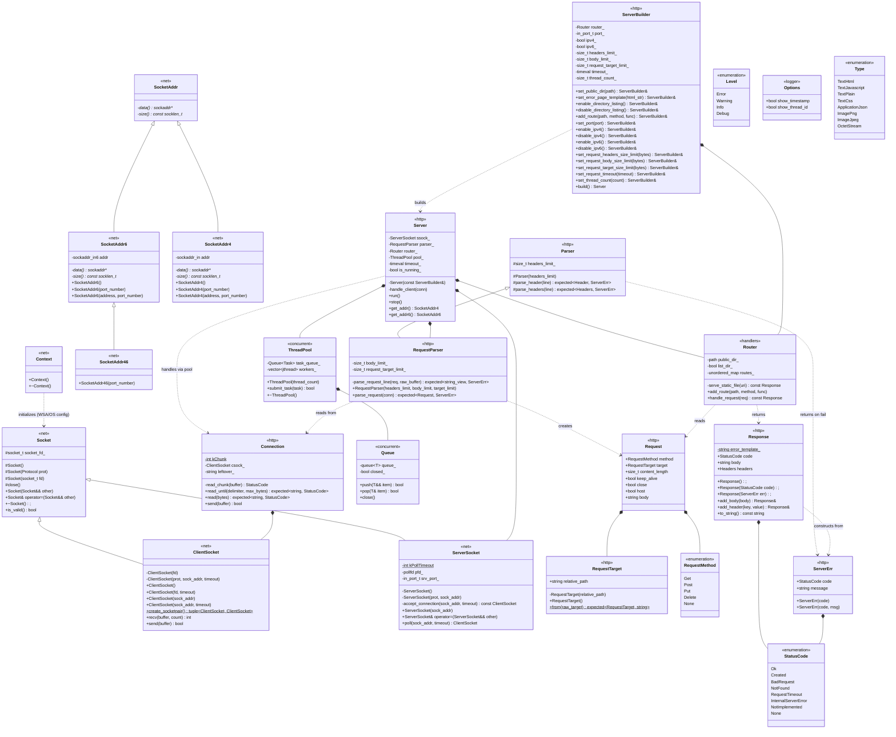

```mermaid
classDiagram
%% -------------------------------------
%% INHERITANCE (is-a relationships)
%% -------------------------------------
Parser <|-- RequestParser
Socket <|-- ClientSocket
Socket <|-- ServerSocket
SocketAddr <|-- SocketAddr4
SocketAddr <|-- SocketAddr6
SocketAddr6 <|-- SocketAddr46

%% -------------------------------------
%% COMPOSITION (Strong ownership: part-of)
%% -------------------------------------
Server *-- RequestParser
Server *-- Router
Server *-- ThreadPool
Server *-- ServerSocket
ServerBuilder *-- Router

Connection *-- ClientSocket
ThreadPool *-- Queue

Request *-- RequestTarget
Request *-- RequestMethod
Response *-- StatusCode
ServerErr *-- StatusCode

%% -------------------------------------
%% DEPENDENCIES (Uses / Creates / Returns)
%% -------------------------------------
ServerBuilder ..> Server : builds
Server ..> Connection : handles via pool
RequestParser ..> Connection : reads from
RequestParser ..> Request : creates
Router ..> Request : reads
Router ..> Response : returns
Context ..> Socket : initializes (WSA/OS config)

Parser ..> ServerErr : returns on fail
Response ..> ServerErr : constructs from

%% =====================================
%% NAMESPACE: concurrent
%% =====================================
class Queue~T~ {
    <<concurrent>>
    -queue~T~ queue_
    -bool closed_
    +push(T&& item) bool
    +pop(T& item) bool
    +close()
}

class ThreadPool {
    <<concurrent>>
    -Queue~Task~ task_queue_
    -vector~jthread~ workers_
    +ThreadPool(thread_count)
    +submit_task(task) bool
    +~ThreadPool()
}

%% =====================================
%% NAMESPACE: handlers
%% =====================================
class Router {
    <<handlers>>
    -path public_dir_
    -bool list_dir_
    -unordered_map routes_
    -serve_static_file(uri) const Response
    +add_route(path, method, func)
    +handle_request(req) const Response
}

%% =====================================
%% NAMESPACE: logger
%% =====================================
class Level {
    <<enumeration>>
    Error
    Warning
    Info
    Debug
}

class Options {
    <<logger>>
    +bool show_timestamp
    +bool show_thread_id
}

%% =====================================
%% NAMESPACE: net
%% =====================================
class Context {
    <<net>>
    +Context()
    +~Context()
}

class Socket {
    <<net>>
    #socket_t socket_fd_
    #Socket()
    #Socket(Protocol prot)
    #Socket(socket_t fd)
    #close()
    +Socket(Socket&& other)
    +Socket& operator=(Socket&& other)
    +~Socket();
    +is_valid() bool
}

class ClientSocket {
    <<net>>
    -ClientSocket(fd)
    -ClientSocket(prot, sock_addr, timeout)
    +ClientSocket()
    +ClientSocket(fd, timeout)
    +ClientSocket(sock_addr)
    +ClientSocket(sock_addr, timeout)
    +create_socketpair()$ tuple~ClientSocket, ClientSocket~
    +recv(buffer, count) int
    +send(buffer) bool 
}

class ServerSocket {
    <<net>>
    -int kPollTimeout$
    -pollfd pfd_
    -in_port_t srv_port_
    -ServerSocket()
    -ServerSocket(prot, sock_addr)
    -accept_connection(sock_addr, timeout) const ClientSocket
    +ServerSocket(sock_addr)
    +ServerSocket& operator=(ServerSocket&& other)
    +poll(sock_addr, timeout) ClientSocket 
}

class SocketAddr {
    <<net>>
    -data()* sockaddr*
    -size()* const socklen_t
}

class SocketAddr4 {
    <<net>>
    -sockaddr_in addr
    -data()* sockaddr*
    -size()* const socklen_t
    +SocketAddr4()
    +SocketAddr4(port_number)
    +SocketAddr4(address, port_number)
}

class SocketAddr6 {
    <<net>>
    -sockaddr_in6 addr
    -data()* sockaddr*
    -size()* const socklen_t
    +SocketAddr6()
    +SocketAddr6(port_number)
    +SocketAddr6(address, port_number)
}

class SocketAddr46 {
    <<net>>
    +SocketAddr46(port_number)
}

%% =====================================
%% NAMESPACE: http::mime
%% =====================================
class Type {
    <<enumeration>>
    TextHtml
    TextJavascript
    TextPlain
    TextCss
    ApplicationJson
    ImagePng
    ImageJpeg
    OctetStream
}

%% =====================================
%% NAMESPACE: http (Parsers & Types)
%% =====================================
class Connection {
    <<http>>
    -int kChunk$
    -ClientSocket csock_
    -string leftover_
    -read_chunk(buffer) StatusCode
    +read_until(delimiter, max_bytes) expected~string, StatusCode~
    +read(bytes) expected~string, StatusCode~
    +send(buffer) bool
}

class Parser {
    <<http>>
    #size_t headers_limit_
    #Parser(headers_limit)
    #parse_header(line) expected~Header, ServerErr~
    #parse_headers(line) expected~Headers, ServerErr~
}

class RequestParser {
    <<http>>
    -size_t body_limit_
    -size_t request_target_limit_
    -parse_request_line(req, raw_buffer) expected~string_view, ServerErr~
    +RequestParser(headers_limit, body_limit, target_limit)
    +parse_request(conn) expected~Request, ServerErr~
}

class RequestMethod {
    <<enumeration>>
    Get
    Post
    Put
    Delete
    None
}

class RequestTarget {
    <<http>>
    +string relative_path
    -RequestTarget(relative_path)
    +RequestTarget()
    +from(raw_target)$ expected~RequestTarget, string~
}

class Request {
    <<http>>
    +RequestMethod method
    +RequestTarget target
    +size_t content_length
    +bool keep_alive
    +bool close
    +bool host
    +string body
}

class StatusCode {
    <<enumeration>>
    Ok
    Created
    BadRequest
    NotFound
    RequestTimeout
    InternalServerError
    NotImplemented
    None
}

class Response {
    <<http>>
    -string error_template_$
    +StatusCode code
    +string body
    +Headers headers
    +Response();
    +Response(StatusCode code);
    +Response(ServerErr err);
    +add_body(body) Response&
    +add_header(key, value) Response&
    +to_string() const string
}

class ServerErr {
    <<http>>
    +StatusCode code
    +string message
    +ServerErr(code)
    +ServerErr(code, msg)
}

%% =====================================
%% NAMESPACE: http (Core Server)
%% =====================================
class ServerBuilder {
    <<http>>
    -Router router_
    -in_port_t port_
    -bool ipv4_
    -bool ipv6_
    -size_t headers_limit_
    -size_t body_limit_
    -size_t request_target_limit_
    -timeval timeout_
    -size_t thread_count_

    +set_public_dir(path) ServerBuilder&
    +set_error_page_template(html_str) ServerBuilder&
    +enable_directory_listing() ServerBuilder&
    +disable_directory_listing() ServerBuilder&
    +add_route(path, method, func) ServerBuilder&
    +set_port(port) ServerBuilder&
    +enable_ipv4() ServerBuilder&
    +disable_ipv4() ServerBuilder&
    +enable_ipv6() ServerBuilder&
    +disable_ipv6() ServerBuilder&
    +set_request_headers_size_limit(bytes) ServerBuilder&
    +set_request_body_size_limit(bytes) ServerBuilder&
    +set_request_target_size_limit(bytes) ServerBuilder&
    +set_request_timeout(timeout) ServerBuilder&
    +set_thread_count(count) ServerBuilder&

    +build() Server
}

class Server {
    <<http>>
    -ServerSocket ssock_
    -RequestParser parser_
    -Router router_
    -ThreadPool pool_
    -timeval timeout_
    -bool is_running_
    -Server(const ServerBuilder&)
    -handle_client(conn)
    +run()
    +stop()
    +get_addr() SocketAddr4
    +get_addr6() SocketAddr6
}
```
