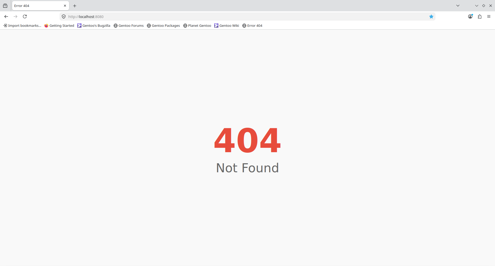

# Basic Example {#example_basic}

The simplest use of the library is in the `examples/basic/main.cpp` file. It looks like this:

```c++
#include <http/server.hpp>

int main()
{
    net::Context context;
    http::Server srv = http::ServerBuilder().build();
    srv.run();
}
```

These 3 lines do the following:
- `net::Context` takes care of the `winsock2` library being properly initialized when used on Windows
- The second line does all the "magic" - `::http::ServerBuilder` class takes care of the configuration of the given server instance
  - if no other function of the form `set_...()`, `enable_...()` or `disable_...()` is called on the class before calling `.build()`, the [default configuration](#default-configuration) is used.
  - The `.build()` function then creates an instance of `::http::Server`, to which the given configuration is passed.
- The third line then starts the server

With the `main()` function looking like this, the running process can only be killed by interrupt (Ctrl+c).

The server could also be stopped more nicely if it were started in a other thread than the main one:

```c++
int main() {
    std::jthread srv_thread([&srv]() {
        srv.run();
    });
    // From here, you can send a request to the server
    srv.stop();
    // srv.stop() switches the server's internal flag
    // which causes it to jump out of the main loop
}
// after the end of the main() function, the jthread will try
// to automatically join, it succeeds thanks to
// the srv.run() function finishing its execution
```

This method of starting the server is used in tests.

## Run

You can run the example from the `project` directory with `./<BUILD-DIR>/examples/basic`.

Because there is no `index.html` file in the `project` directory, when you navigate to `localhost:8080` in the web browser of your choice, you should see this:


