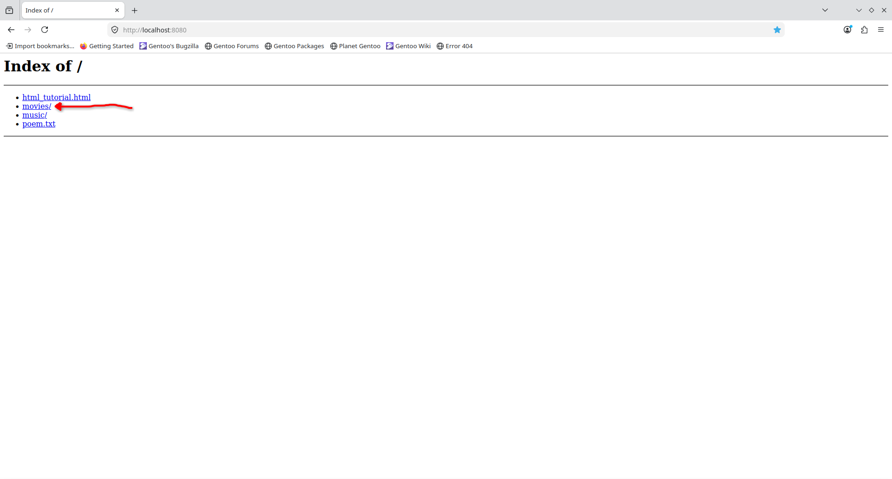
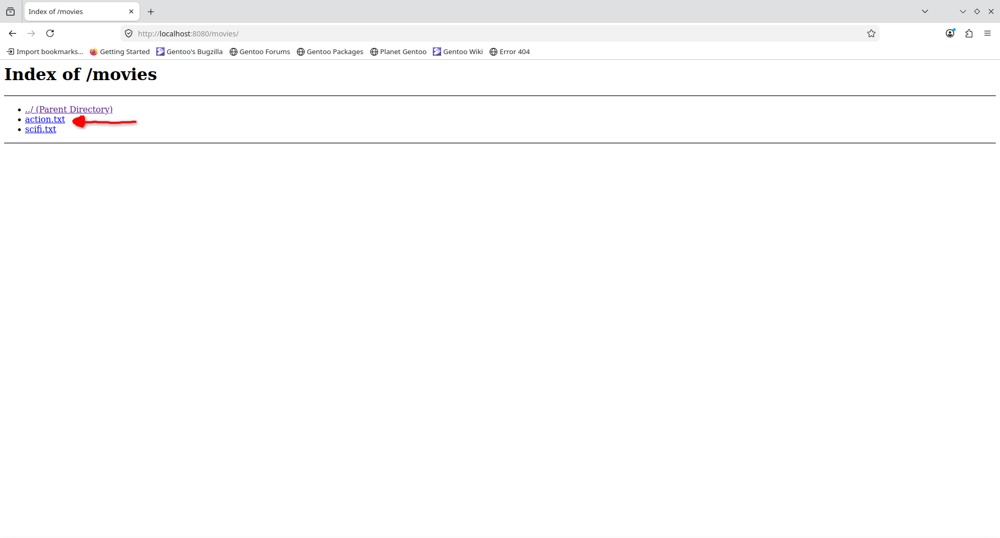
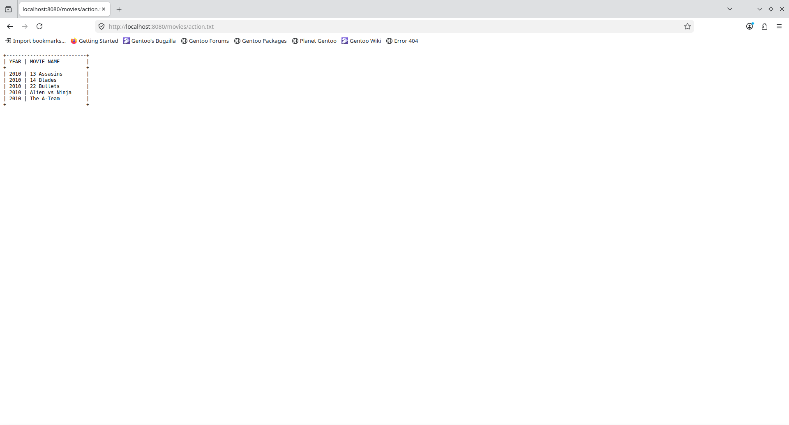

# Directory List Example {#example_dir_list}

The code for directory listing example doesn't add much complexity compared to the [basic](@ref example_basic). Here is the code from `examples/dir_list/main.cpp`:

```c++
#include <http/server.hpp>

#include <source_location>
#include <filesystem>

namespace fs = std::filesystem;

static fs::path public_dir = fs::path(std::source_location::current().file_name()).remove_filename() / "public";

int main()
{
    net::Context context;
    http::Server srv = http::ServerBuilder()
        .set_public_dir(public_dir)
        .enable_directory_listing()
        .build();

    srv.run();
}
```

The difference is that in this example I had to set a specific public directory to demonstrate the functionality of this feature. Public directory is calculated relatively from the `main.cpp` source file location.

## Run

You can run the example from the `project` directory with `./<BUILD-DIR>/examples/dir_list`.

When you navigate to `localhost:8080` in your web browser, you should see the following page:

(**Note:** The red arrow is there only to demonstrate the following action, that I did while testing, which was that I have clicked on the `movies` in the directory listing)



The click on `movies` should take you to this page:



After clicking on `action.txt`, you should see this page:



Go ahead and play around with this. Going up in the folder hierarchy should also work.

The screenshots are here for you to verify that everything is working as expected.
