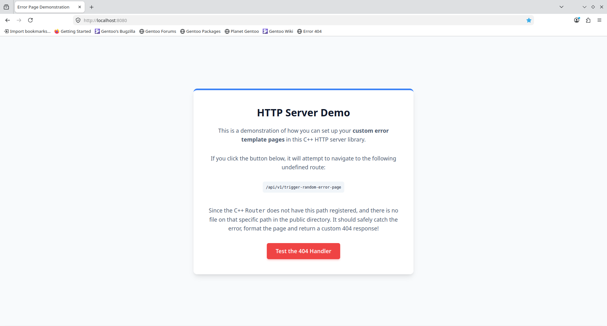
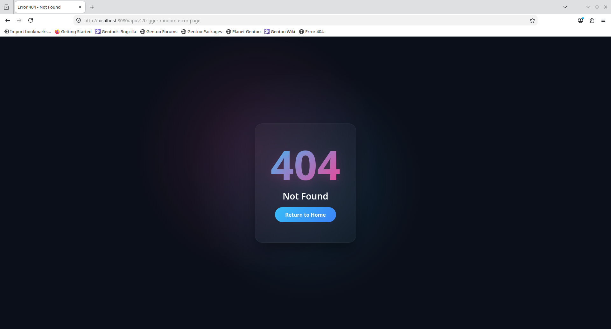

# Error Template Example {#example_err_template}

This examples code is actually quite long, because I've pasted the error template HTML right into the code. So look it up yourself - `examples/err_template/main.cpp`.

## Run

You can run the example from the `project` directory with `./<BUILD-DIR>/examples/err_template`.

When you navigate to `localhost:8080` in your web browser, you should see this homepage:

If you click on the `Test 404 Handler` button, that should redirect you to this page:

