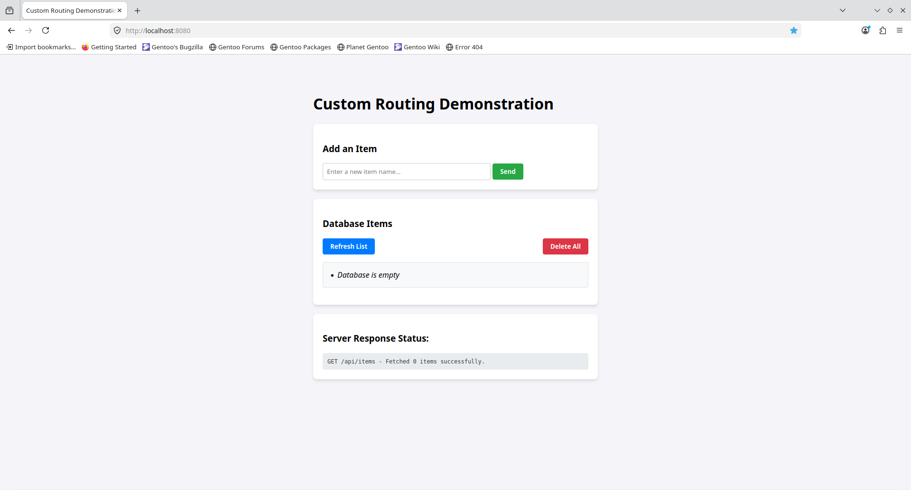
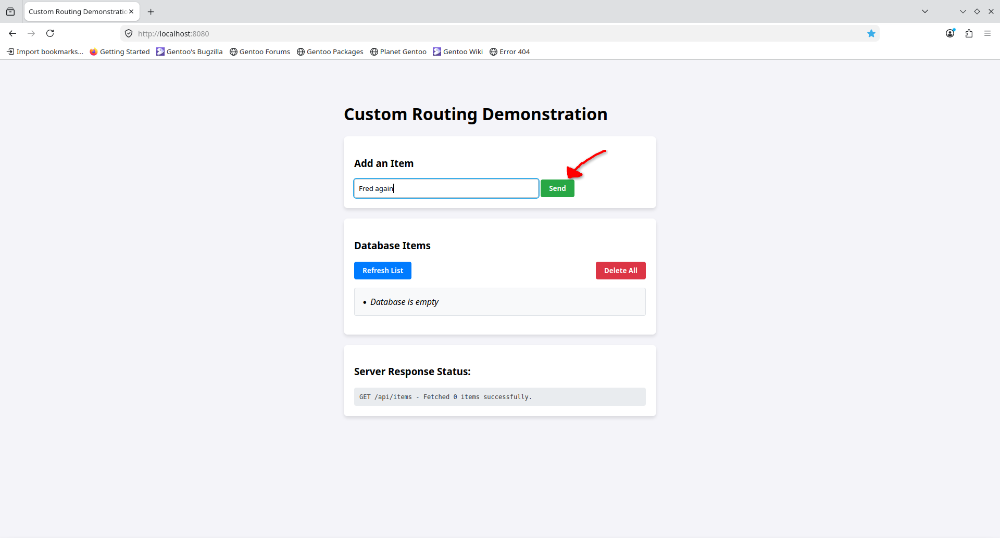
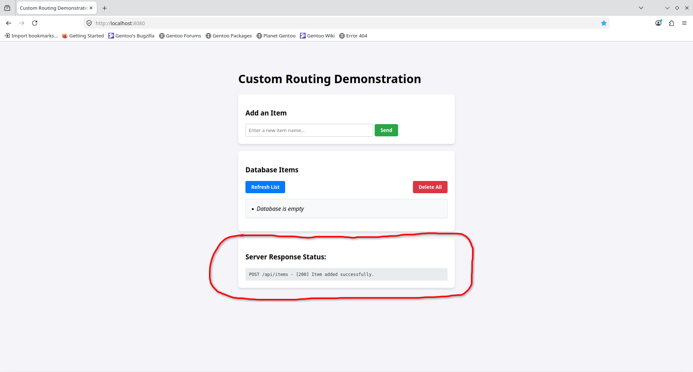
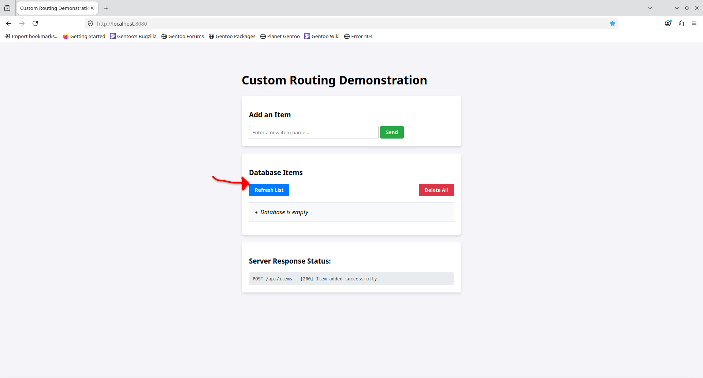
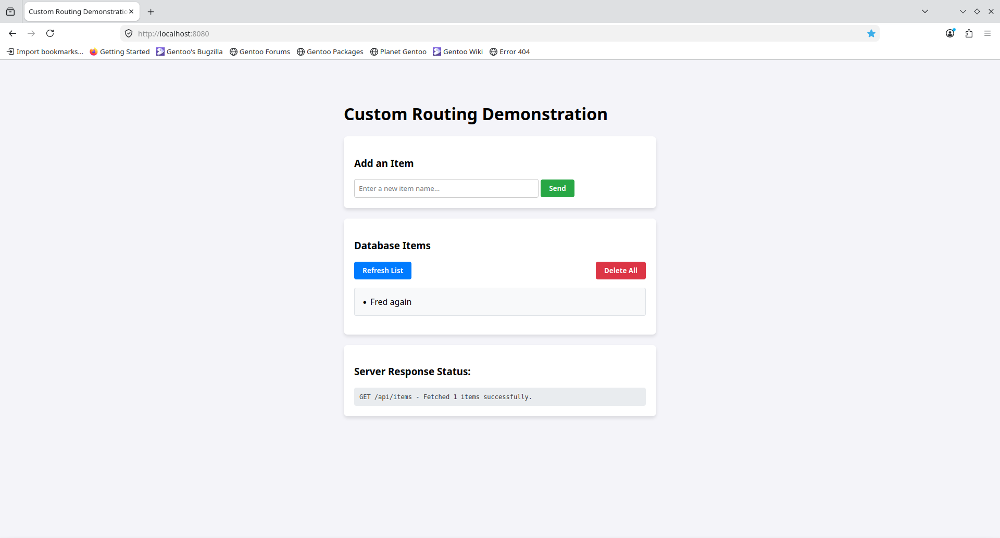

# Routing Example {#example_routing}

You can find the example code in `examples/routing/main.cpp`.

This example demonstrates servers capabilities of defining custom route handlers.

## Run

You can run the example from the `project` directory with `./<BUILD-DIR>/examples/routing`.

When you navigate to `localhost:8080` in your web browser, you should see this homepage:

Let's add an item to the in-memory database:

After you click the `Send` button, you should see this page, I have highlighted the important part of the page that has changed.

The we can click on `Refresh list` to see our if our item has been added to the database:

After you click on `Refresh list` you should see this page:

